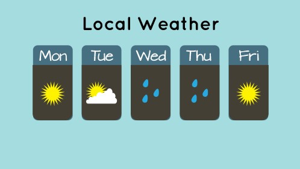

Netlify CMS is a React single page app for editing git based content via API. Its built for non-technical and technical editors alike, and its super easy to install and configure. For more details, check out the [docs site](https://netlifycms.org/).